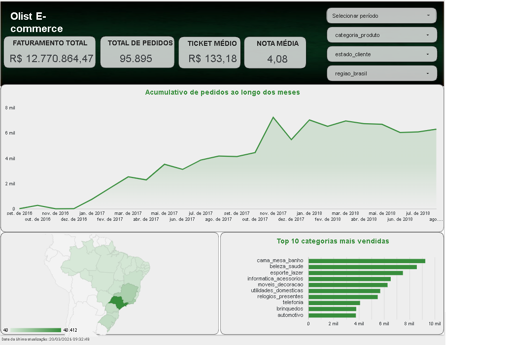
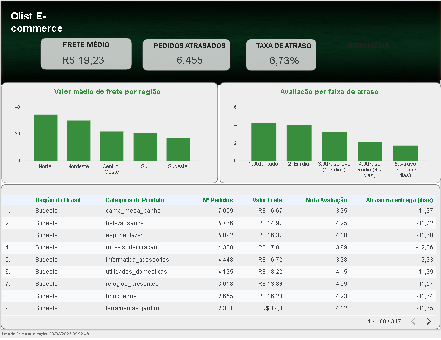

# 📊 E-commerce Analysis & Strategic BI Dashboard

[🇧🇷 Português](#-português) | [🇺🇸 English](#-english)

---
## 🇧🇷 Português

Este projeto apresenta uma Análise Exploratória de Dados (AED) completa sobre o ecossistema de e-commerce da Olist no Brasil. O objetivo foi transformar dados brutos em insights estratégicos, culminando em um dashboard interativo para suporte à decisão logística e comercial.

---
### 📈 Dashboard Interativo

O resultado final pode ser explorado no dashboard interativo através do link abaixo:

🔗 **[LOOKER STUDIO](https://lookerstudio.google.com/reporting/ba638710-7a93-4659-b397-68a269a33763
)**

### 📱 Demonstração do Dashboard

  
  
  

---

### 🚀 Objetivo do Projeto

A missão principal foi consolidar um banco de dados relacional complexo e responder a perguntas críticas de negócio:
*   **Tendência Temporal:** Qual a evolução do volume de pedidos entregues?
*   **Logística:** Como o custo médio do frete varia entre as 5 regiões do Brasil?
*   **Performance (SLA):** Qual o impacto real do atraso na entrega sobre a nota de satisfação do cliente?
*   **Catálogo:** Quais categorias de produtos possuem os maiores desafios logísticos e piores avaliações?

---

### 🛠️ Tecnologias e Ferramentas

*   **Python 3.x**: Linguagem principal para processamento.
*   **Pandas & Numpy**: Manipulação, limpeza e engenharia de atributos.
*   **Matplotlib & Seaborn**: Visualizações estatísticas durante a análise exploratória.
*   **KaggleHub**: Integração para obtenção direta dos datasets.
*   **Google Colab**: Ambiente de desenvolvimento.
*   **Looker Studio**: Construção do Dashboard executivo interativo.

---

### 📑 Etapas do Desenvolvimento

1.  **Limpeza e Consolidação**: Tratamento de valores nulos, duplicatas e união (merge) de múltiplas tabelas (Pedidos, Itens, Clientes, Reviews e Produtos).
2.  **Qualidade dos Dados**:
    *   **Regionalização**: Agrupamento dos 27 estados em 5 regiões geográficas (IBGE) para análise macro, com tratamento para siglas não identificadas (`fillna`).
    *   **Tratamento de Outliers**: Identificação e remoção de valores atípicos de frete (acima de R$ 100,00), garantindo que as médias reflitam a realidade do varejo comum.
3.  **Feature Engineering**: Criação de métricas de performance de entrega (SLA) e cálculo de dias de atraso.
4.  **Business Intelligence**: Exportação de uma base otimizada para o Looker Studio.

---

### 📂 Estrutura do Repositório

*   `/data`: Contém a base processada utilizada no BI.
*   `/notebooks`: Notebook `.ipynb` com o código completo da análise.
*   `/assets`: Imagens de visualização do Dashboard.
*   `README.md`: Documentação e apresentação do projeto.

---
### 🚀 Como Executar o Projeto

Este projeto está dividido em duas etapas: o processamento/limpeza dos dados (Python) e a visualização estratégica (Looker Studio).

#### 1. Processamento dos Dados (Python)
Para replicar a análise e gerar a base de dados tratada:
1.  Acesse o notebook na pasta `/notebooks` ou abra diretamente pelo Google Colab.
2.  O notebook utiliza a biblioteca `kagglehub` para baixar os dados originais automaticamente. Certifique-se de ter conexão com a internet.
3.  Execute todas as células em ordem. 
4.  Ao final da execução, o arquivo processado `olist_dataset_final.csv` será gerado e estará disponível para download na pasta local do ambiente de execução.

#### 2. Dashboard e Visualização (Looker Studio)
O Dashboard interativo é alimentado pelo arquivo CSV gerado na etapa anterior.
1.  **Visualização Direta:** Basta clicar no link disponível na seção [Dashboard Interativo](#-dashboard-interativo) deste README.
2.  **Replicação do Painel:**
    *   Faça o download do arquivo `olist_dataset_final.csv`.
    *   Suba o arquivo para o seu **Google Drive**.
    *   Acesse o [Looker Studio](https://lookerstudio.google.com/), crie uma nova fonte de dados e selecione o conector do **Google Planilhas** ou **Upload de Arquivo**.
    *   Conecte o CSV e comece a explorar as métricas tratadas (Regiões e Fretes sem outliers).
---
### 💡 Principais Insights de Negócio 

A análise exploratória e a visualização dos dados no **Looker Studio** permitiram identificar padrões críticos que impactam a operação da Olist:

1.  **Sazonalidade e Concentração de Mercado**:
    *   **Pico de Vendas:** O volume de transações atinge seu ápice absoluto na **Black Friday**, gerando um faturamento total de **R$ 12,77 Milhões** no período analisado.
    *   **Geografia do Consumo:** Existe uma forte concentração de pedidos no Sudeste (SP e MG), enquanto as regiões Norte e Nordeste enfrentam o "imposto da distância", com fretes médios de **R$ 19,23**, mas que em áreas remotas chegam a dobrar o valor em relação ao Sudeste.

2.  **O Perfil do Consumidor e Ticket Médio**:
    *   **Categorias Líderes:** O Top 10 é dominado por `cama_mesa_banho` e `beleza_saude`, indicando um consumo focado em utilidades domésticas e bem-estar.
    *   **Economia de Volume:** Com um **Ticket Médio de R$ 133,18**, a plataforma depende de alto volume de vendas, já que a margem por produto individual é moderada.

3.  **A Correlação Crítica: Atraso vs. Satisfação**:
    *   **Sensibilidade ao Prazo:** A **Nota Média (4,08)** cai drasticamente de **4.0 para abaixo de 2.0** assim que o atraso ultrapassa 7 dias. 
    *   **Taxa de Atraso:** Atualmente em **6,73%**. Embora pareça baixa, esses **6.455 pedidos atrasados** são os principais geradores de detratores (notas 1 e 2) na plataforma.

---

### 🚀 Recomendações Pragmáticas

Com base nos dados extraídos, as seguintes ações são sugeridas para otimizar os resultados e a experiência do cliente:

*   **📍 Descentralização Logística:** Incentivar a entrada de *Sellers* (vendedores) nas regiões Norte e Nordeste para reduzir o custo do "Last Mile" e aumentar a satisfação nessas localidades.
*   **⚠️ Gestão de Alerta de Atrasos:** Implementar um sistema de gatilhos para o time de Suporte (CS) sempre que um pedido entrar no 3º dia de "atraso leve", evitando que ele evolua para um atraso crítico e gere uma avaliação negativa.
*   **💳 Estratégia de Upselling:** Criar campanhas de frete grátis ou descontos progressivos para carrinhos acima de **R$ 150,00**, visando elevar o Ticket Médio atual (R$ 133,18) e diluir os custos logísticos.
*   **📅 Planejamento de Demanda:** Reforçar a malha logística e o suporte 30 dias antes da Black Friday, dado que o aumento súbito de volume é o principal fator de estresse que gera atrasos subsequentes em dezembro.

---
### 📄 Licença

Este projeto está sob a licença MIT. Veja o arquivo LICENSE para mais detalhes.

---
## 🇺🇸 English

This project presents a comprehensive Exploratory Data Analysis (EDA) on the Olist e-commerce ecosystem in Brazil. The goal was to transform raw data into strategic insights, culminating in an interactive dashboard to support logistical and commercial decision-making.

---
### 📈 Interactive Dashboard

The final results can be explored in the interactive dashboard via the link below:

🔗 **[LOOKER STUDIO](https://lookerstudio.google.com/reporting/ba638710-7a93-4659-b397-68a269a33763
)**

### 📱 Dashboard Preview

  
  
  

---

### 🚀 Project Objective

The main mission was to consolidate a complex relational database and answer critical business questions:
*   **Temporal Trend:** What is the evolution of delivered order volume over time?
*   **Logistics:** How does the average freight cost vary across the 5 regions of Brazil?
*   **Performance (SLA):** What is the real impact of delivery delays on customer satisfaction scores?
*   **Catalog:** Which product categories face the greatest logistical challenges and worst reviews?

---

### 🛠️ Technologies and Tools

*   **Python 3.x**: Main language for data processing.
*   **Pandas & Numpy**: Data manipulation, cleaning, and feature engineering.
*   **Matplotlib & Seaborn**: Statistical visualizations during exploratory analysis.
*   **KaggleHub**: Integration for direct dataset retrieval.
*   **Google Colab**: Cloud development environment.
*   **Looker Studio**: Construction of the interactive executive dashboard.

---

### 📑 Development Stages

1.  **Cleaning and Consolidation**: Handling null values, duplicates, and merging multiple tables (Orders, Items, Customers, Reviews, and Products).
2.  **Data Quality**:
    *   **Regionalization**: Grouping the 27 states into 5 geographical regions (IBGE) for macro-analysis, including handling unidentified abbreviations (`fillna`).
    *   **Outlier Treatment**: Identification and removal of freight outliers (above R$ 100.00), ensuring that averages reflect the reality of standard retail.
3.  **Feature Engineering**: Creation of delivery performance metrics (SLA) and calculation of delay days.
4.  **Business Intelligence**: Exporting an optimized dataset for Looker Studio.

---

### 📂 Repository Structure

*   `/data`: Contains the processed base used in BI.
*   `/notebooks`: `.ipynb` notebook with the full analysis code.
*   `/assets`: Project screenshots and dashboard previews.
*   `README.md`: Project documentation and presentation.

---
### 🚀 How to Run the Project

This project is divided into two stages: data processing/cleaning (Python) and strategic visualization (Looker Studio).

#### 1. Data Processing (Python)
To replicate the analysis and generate the treated database:
1.  Access the notebook in the `/notebooks` folder or open it directly via Google Colab.
2.  The notebook uses the `kagglehub` library to download the original data automatically. Ensure you have an internet connection.
3.  Run all cells in order. 
4.  At the end of the execution, the processed file `olist_dataset_final.csv` will be generated and available for download in the execution environment's local folder.

#### 2. Dashboard and Visualization (Looker Studio)
The interactive Dashboard is powered by the CSV file generated in the previous step.
1.  **Direct Viewing:** Simply click the link available in the [Interactive Dashboard](#-interactive-dashboard) section of this README..
2.  **Dashboard Replication:**
    *   Download the `olist_dataset_final.csv` file.
    *   Upload the file to your **Google Drive**.
    *   Acess [Looker Studio](https://lookerstudio.google.com/), create a new data source, and select the **Google Sheets** or **File Upload connector**.
    *   Connect the CSV and start exploring the treated metrics (Regions and Freight without outliers).
---
### Business Insights & Recommendations

### 📊 Insights
*   **Logistics & Geography:** Shipping costs in Northern Brazil are significantly higher, directly impacting customer satisfaction scores.
*   **The Delay Threshold:** Data shows a sharp decline in review scores (from 4.0 to < 2.0) once a delivery delay exceeds 7 days.
*   **Consumer Profile:** With an average ticket of **BRL 133.18**, success relies on high sales volume in categories like "Home & Bath" and "Health & Beauty".

### 🚀 Recommendations
*   **Regional Expansion:** Recruit local sellers in high-shipping-cost regions to reduce delivery times.
*   **Proactive CS:** Implement automated alerts for orders with a 3-day delay to mitigate negative reviews.
*   **Upselling Strategy:** Offer incentives for orders above BRL 150.00 to increase the average ticket and optimize margins.

---

### 📄 License

This project is licensed under the MIT License. See the LICENSE file for more details.

---

👤 Author / Autora  
Hélen Ferreira – Developer  
📸 [Linkedin](https://www.linkedin.com/in/helensjferreira-dev/)  
💬 [WhatsApp](https://wa.me/5548988183720)  
🔗 [GitHub](https://github.com/helensjferreira-dev/)  
